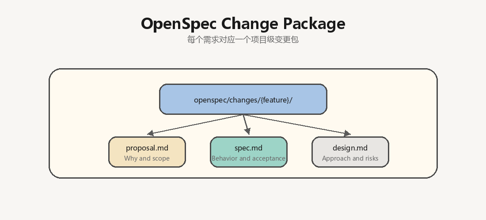
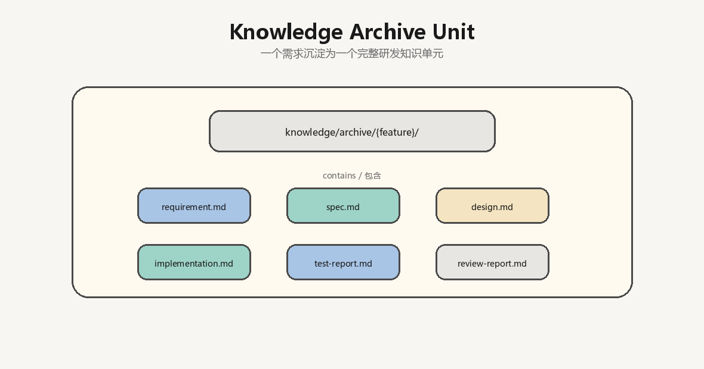

# OSD Workflow

OSD Workflow is a lightweight project template for piloting an OpenSpec + Superpowers AI coding workflow in a real software project.

It does not implement OpenSpec or Superpowers. Instead, it defines the project-level workflow contract, rules, skill mappings, and archive structure that connect:

- Agent/Harness-level Superpowers for AI agent execution and workflow discipline.
- Globally installed OpenSpec CLI for specification operations.
- Project-level OpenSpec workspace assets for requirements, specs, design decisions, acceptance criteria, and knowledge archive.

## Purpose

This template helps teams move from direct prompt-to-code work into a traceable engineering loop:


The goal is to validate a practical AI coding workflow before investing in heavier platforms, marketplaces, gateways, or CI automation.

## Runtime Contract

The recommended local setup is:

- Superpowers is installed per AI agent or harness, usually as a user-level plugin or extension rather than a project dependency.
- OpenSpec CLI is installed globally, for example with `npm install -g @fission-ai/openspec@latest`.
- Each target project runs `openspec init` and maintains its own project-level OpenSpec workspace.
- This repository provides reusable project-level workflow assets.
- OpenSpec change assets are stored in `openspec/changes/{feature}/`.
- Completed requirement archives are stored in `knowledge/archive/{feature}/`.

Responsibility split:


Superpowers answers how the agent should execute the work inside a specific AI agent or harness.

OpenSpec CLI provides the toolchain; the initialized project OpenSpec workspace answers why the project should change, what should change, and how it will be accepted.

## Project Structure


## Workflow

The default workflow is defined in `.ai/workflows/feature-development.yaml`.

Treat the workflow as an execution contract, not loose guidance. Before each stage, the agent must read the stage's referenced `skill` and `rules` files. Internal todo lists, chat summaries, and unstored reasoning do not count as workflow artifacts.

Stages:

1. Requirement analysis
2. OpenSpec creation
3. Spec review
4. Implementation planning
5. AI coding
6. CodeGraph impact analysis
7. Test generation
8. Verification
9. Code review
10. Knowledge archive

## Core Files

- `.ai/AI_WORKFLOW.md`: workflow overview and environment contract.
- `.ai/workflows/feature-development.yaml`: stage definition and runtime responsibility mapping.
- `.ai/rules/workflow-execution-rule.md`: mandatory stage execution, file-reading, and artifact rules.
- `.ai/rules/development-rule.md`: implementation discipline.
- `.ai/rules/testing-rule.md`: test generation and verification rules.
- `.ai/rules/code-review-rule.md`: review priorities and output expectations.
- `.ai/skills/openspec-create/SKILL.md`: mapping for creating OpenSpec changes.
- `.ai/skills/implementation-plan/SKILL.md`: planning before implementation.
- `.ai/skills/test-generation/SKILL.md`: verification generation.
- `.ai/skills/knowledge-archive/SKILL.md`: archive structure and completion criteria.
- `.ai/agents/developer-agent.yaml`: developer agent context contract.
- `.ai/agents/test-agent.yaml`: test agent context contract.
- `bin/osd-workflow-init.mjs`: Node.js CLI installer.
- `scripts/install.ps1`: PowerShell CLI installer.

## How To Use

1. Copy `.ai/`, `openspec/`, and `knowledge/` into a real project.
2. Install OpenSpec CLI globally if needed: `npm install -g @fission-ai/openspec@latest`.
3. Run `openspec init` in the target project.
4. Ensure each team member has Superpowers installed for the AI agent or harness they use.
5. For each feature, create an OpenSpec change under `openspec/changes/{feature}/`.
6. Use `.ai/workflows/feature-development.yaml` as the workflow contract.
7. Archive completed work under `knowledge/archive/{feature}/`.

For prompt templates, project custom instructions, multi-agent usage, and Feishu Project MCP (`FeishuProjectMcp`) integration, see `docs/USAGE.md` and `docs/USAGE_zh.md`.

## One-Command Bootstrap

Use the CLI installer to add this workflow to an existing development project.

PowerShell, recommended for Windows:

```powershell
powershell -NoProfile -ExecutionPolicy Bypass -Command "$p=Join-Path $env:TEMP 'osd-workflow-install.ps1'; iwr https://raw.githubusercontent.com/hpuhsp/OSD-Workflow/main/scripts/install.ps1 -OutFile $p; & $p -Target . -WithDocs"
```

From a cloned copy of this repository:

```powershell
powershell -ExecutionPolicy Bypass -File .\scripts\install.ps1 -Target D:\WorkPlace\demo -WithDocs
```

Node.js / npx:

```bash
npx --yes github:hpuhsp/OSD-Workflow --target . --with-docs
```

Useful options:

- `--target` / `-Target`: target project directory.
- `--with-docs` / `-WithDocs`: also copy `docs/` usage guides.
- `--dry-run` / `-DryRun`: preview changes without writing files.
- `--force` / `-Force`: overwrite existing workflow files.

The installer does not overwrite existing files by default.

## Development Guide: Feishu Project Requirement To Code

This section describes the expected development flow when a requirement comes from Feishu Project.

### 1. Capture Requirement Context

Collect the minimum requirement context before coding:

- Feishu project task or project link.
- Requirement title.
- Business background and user problem.
- Acceptance criteria.
- Comments, decisions, screenshots, or attachments.
- Expected release or priority constraints.

Recommended archive target:

```text
knowledge/archive/{feature}/requirement.md
```

### 2. Create Project-Level OpenSpec Change

After `openspec init` has been run in the project, create a dedicated OpenSpec change for the requirement:



Use `.ai/skills/openspec-create/SKILL.md` as the mapping guide.

The OpenSpec change should clarify:

- Why the change is needed.
- What behavior must change.
- What is explicitly out of scope.
- How the change will be accepted.
- Which modules, interfaces, or data flows may be affected.

### 3. Review The Spec Before Coding

Before implementation, review:

- `openspec/changes/{feature}/proposal.md`
- `openspec/changes/{feature}/spec.md`
- `openspec/changes/{feature}/design.md`
- `.qoder/repowiki`, when available
- `.codegraph`, when available

Do not treat the original Feishu Project description as the only source of truth after OpenSpec is created. The accepted OpenSpec change becomes the project-level source of truth.

### 4. Produce An Implementation Plan

Use `.ai/skills/implementation-plan/SKILL.md` and `.ai/rules/development-rule.md` to produce a concrete plan:

- Affected modules and files.
- Required implementation steps.
- Data model, API, or compatibility impact.
- Test and verification scope.
- Known risks and assumptions.

Recommended archive target:

```text
knowledge/archive/{feature}/implementation.md
```

An internal task list or conversation summary is not enough; the implementation plan must be written to the archive file.

### 5. Implement With Agent/Harness-Level Superpowers

Use Superpowers from the active AI agent or harness to orchestrate the local execution flow.

Project-level assets provide the context and constraints:

- `.ai/workflows/feature-development.yaml`
- `.ai/rules/development-rule.md`
- `.ai/rules/testing-rule.md`
- `.ai/rules/code-review-rule.md`
- `openspec/changes/{feature}/`

Implementation should stay scoped to the accepted OpenSpec change.

### 6. Generate And Run Verification

Use `.ai/skills/test-generation/SKILL.md` and `.ai/rules/testing-rule.md`.

Verification should map each acceptance criterion to one of:

- Automated test.
- Manual verification step.
- Static check.
- Review evidence.

Recommended archive target:

```text
knowledge/archive/{feature}/test-report.md
```

Verification must run relevant commands or document why they could not be run, with residual risk recorded in the test report.

### 7. Review And Archive

Use `.ai/rules/code-review-rule.md` for review priorities.

Archive the completed requirement as a reusable knowledge unit:



The archive should explain why the change exists, what changed, how it was verified, and which follow-ups remain.

## Expected Outputs

For each real requirement, the workflow should produce:

- `openspec/changes/{feature}/proposal.md`
- `openspec/changes/{feature}/spec.md`
- `openspec/changes/{feature}/design.md`
- `knowledge/archive/{feature}/requirement.md`
- `knowledge/archive/{feature}/implementation.md`
- `knowledge/archive/{feature}/test-report.md`
- `knowledge/archive/{feature}/review-report.md`

## Non-Goals

This template does not provide:

- A Harness platform.
- A SkillsHub management platform.
- An MCP marketplace.
- GitLab AI automation.
- An LLM gateway.
- A replacement implementation for OpenSpec or Superpowers.

## License

This project is open source under the MIT License. See `LICENSE` for details.
