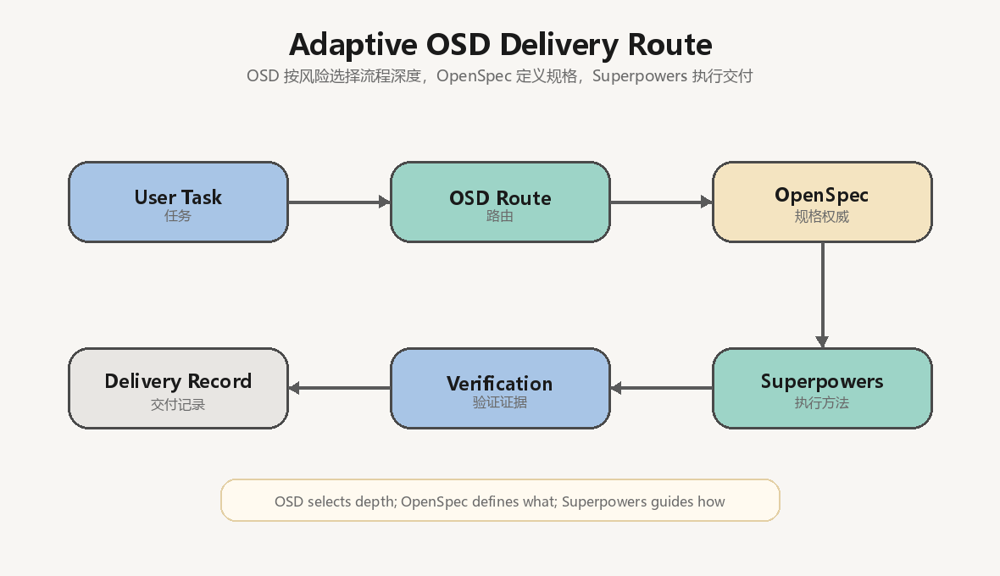
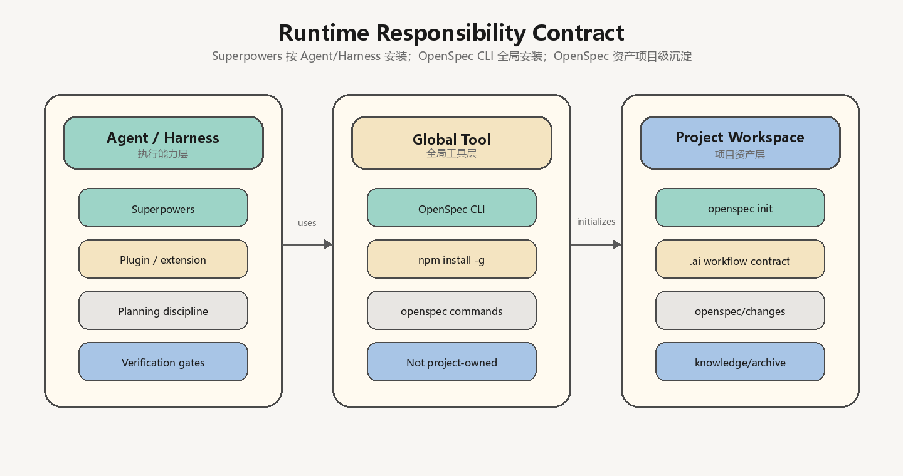
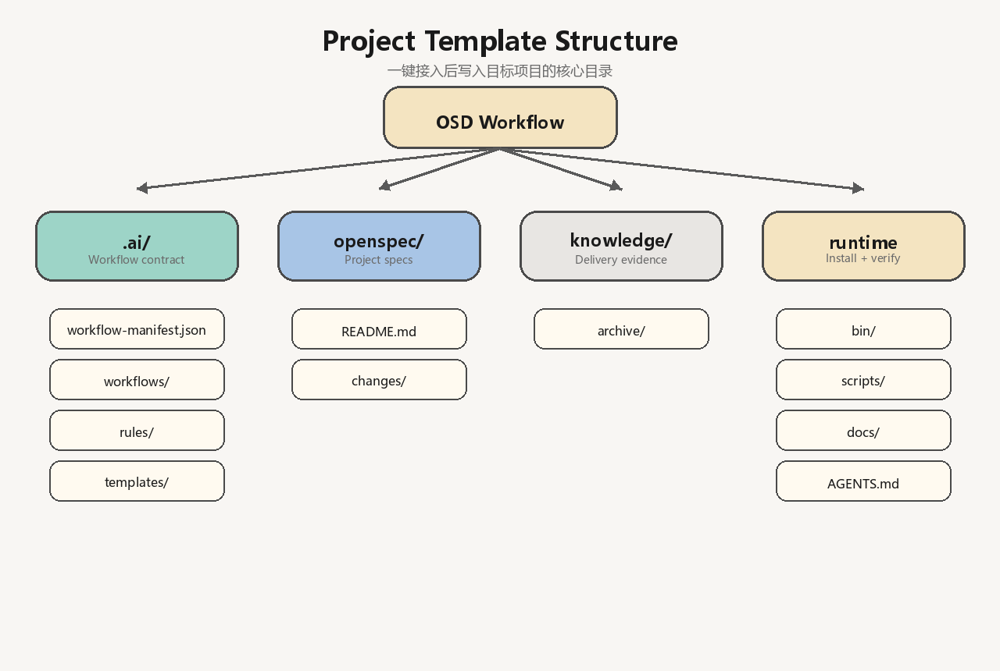

# OSD Workflow

OSD Workflow is a lightweight team standard for adaptive, specification-driven AI development.

OSD Workflow is the top-level controller and connects two required runtime capabilities:

- **OpenSpec** as the specification authority inside the OSD specification stage.
- **Superpowers** as the execution method inside OSD-controlled stages.

OpenSpec and Superpowers participate in every task, but neither replaces or reorders the OSD workflow.

OSD is deliberately thin: it selects process depth and minimum evidence, then delegates the native specification lifecycle to OpenSpec and execution methods to Superpowers.

The project template supplies the shared contract under `.ai/`, OpenSpec assets under `openspec/changes/`, and concise delivery evidence under `knowledge/archive/`.

This repository is the installable template source. It does not implement an application runtime; install it into a target project, then initialize that project's OpenSpec workspace.

## At A Glance







## Design Goal

Standardize the SDD outcome without forcing every task through the same amount of ceremony.

Every task must:

1. Define expected behavior and acceptance criteria in OpenSpec before coding.
2. Implement within the accepted specification through Superpowers-guided execution.
3. Produce focused verification evidence.

## Adaptive Modes

| Mode | Use for | Required flow |
|---|---|---|
| `lite` | Simple, localized, low-risk work | OSD route → compact OpenSpec → implementation → verification |
| `standard` | Normal medium-scope work; default | OSD route → OpenSpec proposal/spec → approval → atomic tasks → implementation → verification → review |
| `strict` | Complex, ambiguous, high-risk, cross-module, or release-critical work | OSD route → full OpenSpec → spec review → approval → atomic tasks → implementation → full verification → review → archive |

OpenSpec and Superpowers participate in all three modes. Only process depth and artifact volume change.

## Development Strategy

Mode and development strategy are separate decisions:

| Strategy | Use for | Evidence |
|---|---|---|
| `tdd` | Core business logic, algorithms, state machines, permissions, billing, public APIs | Red, Green, Refactor |
| `test_first` | Bug fixes, existing behavior changes, refactors | Failing-before and passing-after evidence |
| `verification_only` | Docs, config, pure styling, exploration, impractical test boundary | Reason plus focused verification |

TDD is conditional, not a fourth workflow mode. Summary evidence stays in the delivery record; standard and strict work additionally records structured evidence in `verification.json`. No separate TDD report is required.

## Task-Aware Routing

| Task type | Specification focus | Start mode | Default strategy |
|---|---|---|---|
| New feature | Value, scope, non-goals, acceptance, compatibility | `standard` | `tdd` for executable behavior |
| Bug fix | Reproduction, observed/expected behavior, root cause, regression | `lite` | `test_first` |
| Existing behavior change | Current behavior, desired delta, compatibility, consumers | `standard` | `test_first` |
| Refactor | Behavior invariants, impact, rollback, regression | `standard` | `test_first` characterization |
| Maintenance/docs/config | Exact change, operational impact, focused verification | `lite` | `verification_only` |

Escalate when scope, uncertainty, or risk grows. A user may explicitly choose a lighter or stricter mode if residual risk is recorded.

## Minimal Artifacts

`lite` requires only:

- `openspec/changes/{feature}/spec.md`
- `knowledge/archive/{feature}/stage-report.md`

`standard` adds an OpenSpec proposal, explicit approval, machine-readable state, atomic tasks, structured verification evidence, and a concise implementation plan. Verification and review stay in `stage-report.md` unless a separate report adds risk-control or handoff value. `strict` additionally requires design, full verification/review evidence, and an archive result.

The machine-readable output contract is `.ai/workflow-manifest.json`. Do not duplicate the same information across files. Create `handoff-brief.md` only when another agent will continue the task.

The required delivery files are mode-dependent:

| Mode | Required files |
|---|---|
| `lite` | `openspec/changes/{feature}/spec.md`, `knowledge/archive/{feature}/stage-report.md` |
| `standard` | `proposal.md`, `spec.md`, `approval.md`, `osd-state.json`, `tasks.md`, `verification.json`, `knowledge/archive/{feature}/implementation.md`, `stage-report.md` |
| `strict` | `proposal.md`, `spec.md`, `design.md`, `approval.md`, `osd-state.json`, `tasks.md`, `verification.json`, `archive-result.json`, `implementation.md`, `test-report.md`, `review-report.md`, `stage-report.md` |

The complete paths and optional outputs are defined only by `.ai/workflow-manifest.json`; the table above is a quick reference.

## Install OSD Workflow

Choose one installation method. The installer copies the OSD contract and safely merges a managed discovery block into common Agent instruction files. Existing project instructions remain intact.

Using Node.js / npx:

```bash
npx --yes github:hpuhsp/OSD-Workflow init --target . --with-docs
```

Using PowerShell from a cloned OSD Workflow repository:

```powershell
powershell -ExecutionPolicy Bypass -File .\scripts\install.ps1 -Target D:\WorkPlace\demo -WithDocs
```

Template files are skipped unless `--force` or `-Force` is supplied. Agent instruction files are the exception: only the marked OSD block is merged or refreshed. Use `--dry-run` or `-DryRun` to preview changes.

The installer creates or merges only the root `AGENTS.md` by default. Qoder is supported through its native `AGENTS.md` compatibility. If a project uses Claude, Gemini, GitHub Copilot, or Cursor, copy the same managed entry into that tool's native instruction path as needed; the optional paths are `CLAUDE.md`, `GEMINI.md`, `.github/copilot-instructions.md`, and `.cursor/rules/osd-workflow.mdc`. The installer avoids creating unused duplicate adapters.

### Complete Runtime Setup

After OSD Workflow is installed in the project:

1. Install the OpenSpec CLI globally (the installer does not install it):

   ```bash
   npm install -g @fission-ai/openspec@latest
   ```

2. Initialize the project OpenSpec workspace:

   ```bash
   openspec init
   ```

3. Ensure Superpowers is available in the AI agent or harness used by each developer. It is an execution capability supplied by the harness, not copied into the target project by this repository.

## One-Click Update

Update an existing installation with the currently installed CLI:

```bash
osd-workflow update .
```

Fetch the latest repository version and update in one command:

```bash
npx --yes github:hpuhsp/OSD-Workflow update .
```

Update usage guides too:

```bash
osd-workflow update . --with-docs
```

PowerShell:

```powershell
powershell -ExecutionPolicy Bypass -File .\scripts\install.ps1 -Target . -Update -WithDocs
```

`update` overwrites only files managed by the template. It does not delete project-owned OpenSpec changes or knowledge archives. Use `--dry-run` to preview and review the Git diff after updating. `--with-docs` is opt-in so installed usage guides are not changed unexpectedly.

Manifest v3 migration: active delivery records created by older versions must add `OSD controller: osd_workflow`, non-empty `OpenSpec participation`, and non-empty `Superpowers participation` fields before verification.

## Daily Use

Start a task:

```text
{task}
```

Repository-changing requests automatically trigger OSD when the Agent loads project instructions. For an Agent that does not, use the shortest explicit fallback:

```text
Execute with OSD: {task}
```

The Agent should start with `OSD: <task_type> | <mode> | <strategy> | <current_stage>`, not a generic OpenSpec or Superpowers process.

Verify a delivery:

```bash
node scripts/verify-workflow-artifacts.mjs --feature {feature} --mode {mode}
```

If `--mode` is omitted, the verifier reads the mode from `stage-report.md`, falling back to the manifest default (`standard`). A successful delivery prints `Result: DELIVERY PASS`.

Verify only the installed contract:

```bash
node scripts/verify-workflow-artifacts.mjs --structural-only
```

See [docs/USAGE.md](docs/USAGE.md) for task-specific prompts and routing examples.

## Project Files

- `.ai/workflows/feature-development.yaml`: human-readable routing contract
- `.ai/workflow-manifest.json`: machine-readable artifact contract
- `.ai/rules/workflow-execution-rule.md`: adaptive SDD rules
- `.ai/templates/`: compact delivery and handoff templates
- `AGENTS.md` and Agent-specific adapters: automatic OSD discovery with project instruction preservation
- `scripts/verify-workflow-artifacts.mjs`: lightweight delivery verifier
- `bin/osd-workflow-init.mjs`: Node.js initializer
- `scripts/install.ps1`: PowerShell initializer

For the human workflow guide, see [docs/USAGE.md](docs/USAGE.md). For the Chinese guide, see [docs/USAGE_zh.md](docs/USAGE_zh.md).

## License

MIT
